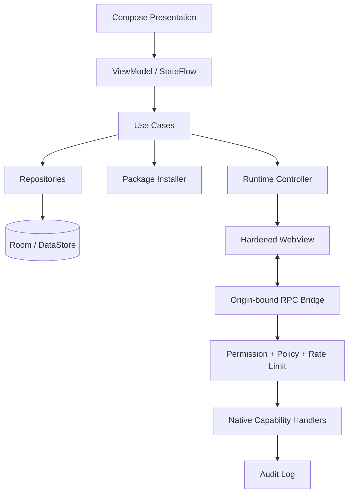

# ToolBox Android 宿主平台：技术方案与开发规范

> 版本：1.0-draft  
> 面向对象：Codex / Android 开发者  
> 目标平台：Android 13+，重点适配 Xiaomi HyperOS 设备  
> 核心定位：将 HTML/CSS/JavaScript 小工具以 `.tbx` 包导入一个原生 Android 宿主 App，并在可审计、可授权、可隔离的运行环境中使用。

---

## 0. 核心结论

ToolBox 不是“把多个网页硬编码进一个 APK”，而是一个本地小工具运行平台：

```text
.tbx 小工具包
   ↓ SAF 导入
结构校验 / 完整性校验 / 风险扫描
   ↓
权限审核与原子安装
   ↓
独立 Origin + 可选独立 WebView Profile
   ↓
HTML/CSS/JS 运行
   ↕ 受控消息桥
ToolBox JS API
   ↓
原生能力、按工具授权、审计与限流
```

必须坚持以下工程边界：

1. **宿主 App UI 使用 Kotlin + Jetpack Compose + Miuix。**
2. **HTML 小工具内部 UI 不由宿主统一设计。** 宿主仅提供运行外壳、安全状态和能力入口。
3. **不使用 `file://` 加载工具文件，不使用 Ktor/localhost 常驻服务器。**
4. **不为导入工具使用 `addJavascriptInterface`。** 使用来源可校验的消息桥。
5. **不申请 `MANAGE_EXTERNAL_STORAGE`。** 导入、导出和文件选择一律通过 SAF。
6. **网络默认关闭。** 工具只能经原生代理 API 访问 manifest 声明并由用户授权的 HTTPS 域名。
7. **安装必须原子化，可失败回滚；升级必须保留上一版本。**
8. **未签名工具默认严格模式。** 高风险权限不可静默持久授权。

---

# 1. 产品范围

## 1.1 第一版必须完成

- 明亮模式原生宿主界面；支持系统/深色/Monet 的后续扩展。
- 首页工具集合：搜索、最近使用、分类、排序、固定。
- 工具管理：已安装列表、版本、占用空间、导出、卸载、回滚。
- `.tbx` 导入：结构校验、manifest 校验、完整性校验、权限审核、风险提示、原子安装。
- HTML 运行容器：离线资源加载、严格导航控制、桥接初始化、渲染进程崩溃恢复。
- ToolBox JS API v1：存储、剪贴板、分享、文件、网络、设备基础信息、震动、通知、快捷方式、加密摘要、事件。
- 工具级权限中心：一次、会话、始终、每次询问、拒绝、封禁。
- 安全审计：安装结果、权限变更、敏感 API 调用、网络目标、失败原因。
- 导出：仅代码包；“代码 + 数据”加密备份作为 P1。
- 开发者模式：本地热重载、控制台、桥接检查器、CSP 报告、权限模拟。

## 1.2 明确不做

- 不提供在线应用商店、账号体系、云同步和付费体系。
- 不允许小工具任意执行 shell、Dex、JNI、APK、WebAssembly JIT 或动态原生代码。
- 不向小工具暴露 root、无障碍、通知读取、短信、联系人、通话记录等高敏感系统能力。
- 不宣称“独立进程”等价于 Android 独立 UID 沙箱。
- 不在宿主层规定仓位计算器、单位换算等工具的具体 HTML 视觉风格。

---

# 2. 技术栈与版本策略

## 2.1 基线

```text
Kotlin              2.x，与当前 Android Gradle Plugin 兼容的稳定版本
JDK / JVM target    21
compileSdk          37
minSdk              33
目标设备             Android 13–17；优先验证 HyperOS / Android 16
UI                   Jetpack Compose + Miuix
Web runtime          Android WebView + AndroidX WebKit 1.17.0
Persistence          Room + DataStore
Serialization        kotlinx.serialization
Async                Kotlin Coroutines + Flow
Image                 Coil 3（仅宿主图标）
File access           Storage Access Framework
Testing               JUnit, Robolectric, AndroidX Test, Compose UI Test
```

`targetSdk` 应使用构建时稳定且通过回归测试的版本，不要为追求数字直接启用尚未验证的行为变更。

## 2.2 Miuix 引入原则

Miuix 作为主设计系统，使用：

```kotlin
implementation("top.yukonga.miuix.kmp:miuix-ui:0.9.4-rc01")
implementation("top.yukonga.miuix.kmp:miuix-preference:0.9.4-rc01")
implementation("top.yukonga.miuix.kmp:miuix-icons:0.9.4-rc01")
implementation("top.yukonga.miuix.kmp:miuix-squircle:0.9.4-rc01")
implementation("top.yukonga.miuix.kmp:miuix-nav:0.9.4-rc01")
```

Miuix 处于实验阶段，API 可能变化，因此：

- 所有页面只依赖 ToolBox 自有 UI 适配层。
- 不允许在 feature 层直接大量 import 第三方组件。
- 升级 Miuix 时必须跑截图回归、Compose UI Test 和性能基准。

本方案锁定 Miuix `v0.9.4-rc01`。该版本以 `miuix-nav` 替代已移除的
`miuix-navigation3-ui`，不再引入 `androidx.navigation3`；导航运行时通过
`rememberNavBackStack`、`NavDisplay` 和 `NavController` 提供连续栈深度
（`animatedTop`）、滑动/模态转场、预测性返回和侧滑关闭。应用不得在其外再叠加
另一套 Navigation3 转场。该版本的 Android 最低 API 为 24；本项目当前 minSdk 33，
满足此要求。

## 2.3 HyperX Compose 引入原则

HyperX Compose 当前更像源码组件集合，没有稳定发布说明。不要把生产项目直接绑定到其 `main`：

- 推荐将选定 commit 作为 `:vendor-hyperx` Git submodule；或
- 将 `HyperXAppLayout`、`HyperXPage`、`HyperXScaffold`、`AdaptiveIcon`、`IntegratedTextField` 等经过审查的源码复制到 `:core-ui`；
- 保留 Apache-2.0 LICENSE、来源和 commit 记录；
- 对外统一包装为 ToolBox 自有组件。

**优先级：Miuix > 自定义稳定组件 > HyperX 适配组件。**

---

# 3. 总体架构

## 3.1 Gradle 模块

```text
:app                 App 入口、导航、feature 页面组装
:core-ui             主题、Miuix/HyperX 适配、自有组件
:core-data           Room、DataStore、Repository、日志
:tool-package        .tbx 解析、校验、完整性、签名、安装/升级/导出
:tool-runtime        WebView、AssetLoader、Profile、导航、CSP、生命周期
:tool-api            RPC 协议、JS API handler、权限策略、限流、审计
:vendor-hyperx       可选；固定 commit 的 HyperX 源码模块
```

不要在第一版为每个页面单独建 Gradle 模块。feature 以 package 分层，等编译时间或团队边界真正需要时再拆。

## 3.2 分层



## 3.3 关键接口

```kotlin
interface ToolPackageService {
    suspend fun inspect(uri: Uri): ImportInspection
    suspend fun install(sessionId: String, grants: InitialGrantPlan): InstallResult
    suspend fun update(sessionId: String): UpdateResult
    suspend fun rollback(toolId: String): RollbackResult
    suspend fun export(toolId: String, destination: Uri, mode: ExportMode)
}

interface ToolRuntimeController {
    suspend fun createSession(toolId: String): RuntimeSession
    suspend fun destroySession(sessionId: String)
    suspend fun clearToolProfile(toolId: String)
}

interface CapabilityPolicy {
    suspend fun authorize(request: CapabilityRequest): AuthorizationDecision
}

interface ToolApiHandler {
    val method: String
    suspend fun execute(context: ToolCallContext, params: JsonElement): JsonElement
}
```

---

# 4. 宿主界面设计

## 4.1 视觉方向

- 默认明亮模式，接近 HyperOS 原生设置与安全中心体验。
- 大面积浅灰蓝背景，白色卡片，蓝色主操作；高风险使用红色，警告使用橙色，可信状态使用绿色。
- 宿主强调“工具、权限、安全、来源”，不喧宾夺主。
- 采用 8 dp 间距系统；卡片半径 18–22 dp，主要弹层 28 dp。
- 状态反馈必须同时使用颜色、图标与文字，禁止只靠颜色表达风险。

### 设计 Token

| Token | 值 | 用途 |
|---|---:|---|
| `primary` | `#3482FF` | 主按钮、选中导航、关键链接 |
| `onPrimary` | `#FFFFFF` | 主色上的文字图标 |
| `background` | `#F3F6FB` | 页面背景 |
| `surface` | `#FFFFFF` | 卡片、弹层 |
| `textPrimary` | `#111827` | 主要文字 |
| `textSecondary` | `#737B8C` | 描述、元数据 |
| `success` | `#34C759` | 已验证、低风险 |
| `warning` | `#FF9500` | 未签名、中风险 |
| `danger` | `#FF3B30` | 签名无效、高风险、破坏操作 |
| `divider` | `#E8EDF5` | 分割线 |

字体使用系统字体，不打包或分发小米专有字体。字号由系统缩放；不得锁死 `fontScale`。

## 4.2 信息架构

底部主导航：

1. **首页**：使用工具。
2. **工具**：管理安装包、分类、更新、空间。
3. **设置**：主题、全局安全策略、备份、开发者模式。

宿主底部主导航使用 Miuix `NavigationBar`。每个 `NavigationBarItem` 的官方内容区为
64 dp；系统导航/手势区域由 `NavigationBar` surface 内部单独消费，页面内容和外层
`Scaffold` 不得重复追加。紧凑页面使用 Miuix `SmallTopAppBar` 的 52 dp 内容高度
（状态栏 inset 另由该 surface 消费）。在大字体或窄屏下使用
`IconWithSelectedLabel`：未选项仅保留图标，选中项显示标签，不能按 `fontScale`
整体放大导航栏。

全局导入入口使用首页/工具页右下角 `FloatingActionButton`。

## 4.3 页面清单

### A. 首页 / 工具集合

组成：

- `SmallTopAppBar`：标题、搜索、更多菜单；需要滚动收缩时才使用 `TopAppBar`。
- 汇总卡：工具数量、最近运行、数据占用。
- 搜索框：名称、分类、标签全文筛选。
- 最近使用：横向小卡片。
- 全部工具：可切换分类，3 列宫格；支持拖动排序。
- 未签名或高风险工具在图标角标显示状态，但不污染正常使用。
- 长按工具：固定、工具详情、权限、导出、卸载。

### B. 工具管理

- 顶部统计：数量、代码体积、数据体积。
- Tab：已安装 / 分类 / 可更新。
- 列表项：图标、名称、版本、大小、最近使用、签名状态、更多菜单。
- 列表/宫格切换。
- 批量模式：导出、移动分类、卸载；卸载需要二次确认。

### C. 导入审核 / 安装确认

这是核心安全页面，必须在安装前展示：

- 工具名称、版本、来源文件名、发布者与签名状态。
- 结构扫描：Zip Slip、路径冲突、文件数、解压后体积、入口文件。
- 安全配置：Strict/Compat、是否存在内联脚本、是否申请网络。
- 权限清单：权限名称、理由、风险级别、是否必需。
- 域名清单：精确展示，不用“访问网络”一行笼统替代。
- 安装按钮文案根据状态变化：`安装并授权` / `继续安装未签名工具` / `禁止安装`。

### D. 工具详情

- 基本信息、版本、发布者、签名指纹、安装时间。
- 权限与最近调用。
- 代码体积、数据体积、WebView Profile 占用。
- 更新历史、回滚入口。
- 创建桌面快捷方式、导出、清数据、卸载。

### E. 权限中心 / 安全审计

- 汇总：低风险工具、需关注、高风险。
- 按工具管理授权。
- 单项权限可选择：仅本次、使用期间、始终允许、每次询问、拒绝。
- 审计日志筛选：工具、API、结果、时间、域名、风险级别。
- 全局策略：
  - 未签名工具禁止联网；
  - 未签名工具禁止持久高风险权限；
  - 自动撤销长期未使用授权；
  - 保留审计日志天数；
  - 开发者模式例外策略。

### F. 设置

- 外观：系统/明亮/深色/Monet，主题种子色。
- 运行：默认安全配置、退出时清理、后台音频禁止。
- 数据：导出、导入备份、清缓存、每工具配额。
- 安全：可信发布者、签名策略、网络策略、日志保留。
- 开发者：调试工具、控制台、桥接检查器、允许未签名调试包。
- 关于：版本、开源许可、WebView 版本、JS API 版本。

### G. 小工具运行外壳

宿主只设计外壳：

- 顶栏：返回、工具名、刷新、更多。
- 安全状态条：`已验证 / 未签名`、`独立 Origin`、`Strict CSP`。
- 中央区域：WebView，完全由导入 HTML 渲染。
- 底部或浮动工具栏：权限、外部打开、调试、详情。
- WebView 崩溃时显示恢复页，不让整个 App 崩溃。

## 4.4 自适应布局

- 手机：Miuix `NavigationBar`（64 dp item 内容 + 内部系统导航/手势 inset）、单列详情、3 列工具宫格。
- 折叠屏/平板：NavigationRail + 双栏；左侧工具列表，右侧详情或预览。
- 宽度断点建议：`<600dp` compact；`600–840dp` medium；`>840dp` expanded。
- 所有点击目标至少 48 dp；正文对比度满足 WCAG AA；支持 TalkBack 语义。

## 4.5 效果图

设计目录：

```text
design/host_ui_light.png       完整 2560×1600 方案板
design/host_ui_light.html      可编辑 HTML 版本
design/01_home.png             首页局部图
design/02_tool_manager.png     工具管理局部图
design/03_import_review.png    导入审核局部图
design/04_permission_center.png 权限中心局部图
design/05_runtime_shell.png    运行外壳局部图
```

该效果图是视觉规格图，不是已运行的 Compose 截图。实现必须以信息层级、组件关系和视觉 Token 为准，不需要逐像素复制手机外框。

---

# 5. `.tbx` 包格式

## 5.1 文件结构

```text
position-calculator.tbx     # ZIP 容器，自定义扩展名
├── manifest.json           # 必需
├── index.html              # manifest.entry 指向
├── style.css
├── app.js
├── icon.png
├── assets/
├── integrity.json          # 推荐；列出所有内容文件 SHA-256
└── signature.json          # 可选；Ed25519 签名 integrity.json 原始字节
```

禁止：

- 绝对路径、`..`、反斜杠绕过、空文件名；
- 大小写冲突或 Unicode 规范化后冲突的路径；
- 符号链接、硬链接、设备文件；
- APK、DEX、SO、JAR、class 文件；
- 嵌套压缩包；
- 超出限制的单文件或总解压体积。

## 5.2 默认限制

| 项目 | 默认 | 上限策略 |
|---|---:|---|
| 压缩包体积 | 20 MiB | 导入前拒绝 |
| 解压后体积 | 80 MiB | 流式累计，超限立即中止 |
| 文件数量 | 512 | 超限拒绝 |
| 单文件体积 | 20 MiB | 超限拒绝 |
| 路径长度 | 180 字符 | 超限拒绝 |
| 压缩比 | 100:1 | 疑似 Zip Bomb，拒绝或高风险阻断 |
| manifest | 128 KiB | 超限拒绝 |
| JS API 单消息 | 256 KiB | 超限返回 `E_INVALID_ARGUMENT` |

宿主配置可降低，不允许包自行突破硬上限。

## 5.3 完整性与签名

`integrity.json`：

```json
{
  "schemaVersion": 1,
  "algorithm": "SHA-256",
  "files": {
    "manifest.json": "<hex>",
    "index.html": "<hex>",
    "app.js": "<hex>"
  }
}
```

`signature.json`：

```json
{
  "schemaVersion": 1,
  "algorithm": "Ed25519",
  "keyId": "sha256:<publisher-public-key>",
  "signedFile": "integrity.json",
  "signature": "<base64>"
}
```

签名对象是压缩包内 `integrity.json` 的**原始 UTF-8 字节**，避免 JSON 重排造成歧义。导入器先验证签名，再按 integrity 校验所有文件。`signature.json` 本身不列入 integrity。

签名状态：

- `VERIFIED_TRUSTED`：签名有效且发布者在信任库。
- `VERIFIED_UNKNOWN`：签名有效但发布者未信任。
- `UNSIGNED`：没有签名。
- `INVALID`：签名或内容哈希不一致，默认禁止安装。

## 5.4 manifest

正式 Schema：`schema/manifest.schema.json`。示例：`examples/position-calculator/manifest.json`。

关键约束：

- `id` 使用反向域名，安装后不可变。
- `versionCode` 必须单调递增；降级只允许明确选择“回滚”。
- `permissions[].reason` 必须是用户可理解的用途，不接受空泛描述。
- 申请 `network` 时必须给出 `network.allowDomains`。
- `securityProfile` 只能是 `strict` 或 `compat`；生产工具不得使用开发者配置。

---

# 6. 导入、安装、升级与导出

## 6.1 导入流水线

```mermaid
flowchart LR
  A[SAF 选择 .tbx] --> B[复制到私有 cache/import/session]
  B --> C[读取中央目录与硬限制]
  C --> D[路径/类型/碰撞校验]
  D --> E[流式解压到临时目录]
  E --> F[解析并校验 manifest]
  F --> G[完整性/签名验证]
  G --> H[静态风险扫描]
  H --> I[生成 ImportInspection]
  I --> J[用户权限审核]
  J --> K[原子移动到版本目录]
  K --> L[Room 事务登记]
  L --> M[安装完成]
```



要求：

- 所有解压写入都必须先 `normalize()`，并确认目标路径仍位于 session 临时目录。
- 按字节流累计解压体积，不得先完整解压再检查。
- 对路径执行 NFC 规范化和小写碰撞检查。
- 任何失败删除 session 目录，不能留下半安装状态。
- 安装目录与数据库登记采用“两阶段提交”：先落临时版本，再原子 rename，再 Room 事务。
- 首次运行前仍需验证入口存在且 MIME 类型合理。

## 6.2 静态风险扫描

扫描结果只做风险提示，不声称能证明代码安全：

- 内联 `<script>`、`eval`、`new Function`、动态 script 注入；
- 外部 URL、`iframe`、`object`、`embed`、WebSocket；
- 大量混淆、超长单行、Base64 大对象；
- 申请权限但代码中没有相应 API 使用；
- 代码使用未声明的 ToolBox API；
- CSP strict 不兼容项。

`INVALID_SIGNATURE`、Zip Slip、禁止文件类型属于阻断项；代码混淆等属于提示项。

## 6.3 升级与回滚

目录：

```text
files/miniapps/<toolId>/
├── versions/
│   ├── 12/bundle/
│   └── 13/bundle/
├── active.json             # 当前 versionCode；原子替换
└── data/                   # 与代码版本解耦
```

- 默认保留当前版 + 上一版。
- 升级先安装新版本，不覆盖旧目录。
- 首次启动新版本成功后才标记稳定；连续启动崩溃可提示回滚。
- manifest 可在未来增加 `dataSchemaVersion` 和迁移脚本，但 v1 不执行任意迁移代码；只保留 KV 数据。

## 6.4 导出

- **代码包**：重新生成 integrity，可选本地开发者签名。
- **代码 + 数据备份**：P1，使用用户密码派生密钥并加密；不得把 secureStorage 明文导出。
- 导出由 `ACTION_CREATE_DOCUMENT` 完成，不写公共目录绝对路径。

---

# 7. WebView 运行时

## 7.1 独立 Origin

每个工具使用固定、不可猜测冲突的 HTTPS Origin：

```text
https://<base32(sha256(toolId))[0..25]>.toolbox.invalid/
```

通过 `WebViewAssetLoader.Builder().setDomain(host)` 与自定义 `PathHandler` 提供本地文件。不能使用共享的 `https://appassets.androidplatform.net/` 作为全部工具的同一 Origin，否则工具之间的浏览器存储与同源能力会混杂。

## 7.2 独立 WebView Profile

运行环境支持相应 WebKit feature 时：

```text
profile name = tbx_<sha256(toolId) 前 24 位>
```

为每个工具设置独立 Profile，使 Cookie、WebStorage、地理位置授权和 ServiceWorker 状态不共享。卸载工具时删除对应 Profile。

兼容回退：若 Profile API 不支持，依靠独立 Origin，并禁止 Cookie、ServiceWorker 与远程页面。

## 7.3 WebView 设置

```kotlin
@SuppressLint("SetJavaScriptEnabled")
fun harden(webView: WebView) = with(webView.settings) {
    javaScriptEnabled = true
    domStorageEnabled = true
    allowFileAccess = false
    allowContentAccess = false
    allowFileAccessFromFileURLs = false
    allowUniversalAccessFromFileURLs = false
    mixedContentMode = WebSettings.MIXED_CONTENT_NEVER_ALLOW
    setSupportMultipleWindows(false)
    javaScriptCanOpenWindowsAutomatically = false
    mediaPlaybackRequiresUserGesture = true
    loadsImagesAutomatically = true
    builtInZoomControls = false
    displayZoomControls = false
}
```

同时：

- `android:usesCleartextTraffic="false"`；
- 启用 Safe Browsing；
- 禁止第三方 Cookie；默认禁用全部 Cookie；
- 禁止保存密码和表单敏感信息；
- `shouldInterceptRequest` 只允许当前工具 Origin 的本地资源；其他请求返回阻断响应；
- `shouldOverrideUrlLoading` 拒绝内部跳转到其他 Origin，外部链接交给宿主确认后用 Custom Tabs；
- 文件选择必须通过 `ToolBox.files`，不直接开放 WebView `onShowFileChooser`；
- 实现 `onRenderProcessGone`，销毁失效 WebView 并展示恢复页；
- 禁止 WebView 调试，除非宿主开发者模式且工具来源为 development。

## 7.4 CSP 与响应头

自定义 PathHandler 对 HTML 注入响应头：

### strict

```text
Content-Security-Policy:
  default-src 'self';
  script-src 'self';
  style-src 'self' 'unsafe-inline';
  img-src 'self' data: blob:;
  font-src 'self' data:;
  connect-src 'none';
  media-src 'self' blob:;
  frame-src 'none';
  object-src 'none';
  base-uri 'none';
  form-action 'none';
  worker-src 'self' blob:;
  upgrade-insecure-requests
X-Content-Type-Options: nosniff
Referrer-Policy: no-referrer
Permissions-Policy: camera=(), microphone=(), geolocation=(), payment=(), usb=()
```

### compat

仅额外允许 `script-src 'self' 'unsafe-inline'`，导入页必须显示警告；**永远禁止 `unsafe-eval`**。网络仍只能通过 ToolBox 原生 API。

## 7.5 运行进程

可将 `RuntimeActivity` 放在 `:tool_runtime` 次进程：

```xml
<activity
    android:name=".runtime.RuntimeActivity"
    android:exported="false"
    android:process=":tool_runtime"
    android:hardwareAccelerated="true" />
```

这只用于降低 WebView 崩溃、内存泄漏和主进程污染，不是独立 UID 安全沙箱。真正的安全边界仍是：私有文件、独立 Origin/Profile、导航限制、CSP、消息来源校验、能力权限和原生代理。

---

# 8. ToolBox JS API v1

TypeScript 声明：`sdk/toolbox-api.d.ts`。

## 8.1 设计原则

- Promise-based；不暴露同步阻塞原生方法。
- 命名空间稳定，可按 `apiVersion` 协商。
- 每个 API 都必须经过 manifest 声明、用户授权、系统授权和策略检查。
- 文件使用短期 `FileToken`，不向 JavaScript 暴露真实路径或 `content://` URI。
- 敏感调用必须由近期用户手势触发。
- 所有返回值可 JSON 序列化；二进制只用 `ArrayBuffer`/分块。
- 宿主记录最小审计元数据，默认不记录用户正文、剪贴板内容或 HTTP body。

## 8.2 命名空间

```text
ToolBox.ready
ToolBox.app
ToolBox.ui
ToolBox.permissions
ToolBox.storage
ToolBox.secureStorage
ToolBox.clipboard
ToolBox.share
ToolBox.files
ToolBox.network
ToolBox.device
ToolBox.haptics
ToolBox.notifications
ToolBox.shortcuts
ToolBox.crypto
ToolBox.events
```

### P0 API

```ts
await ToolBox.ready()
await ToolBox.ui.toast("完成")
await ToolBox.storage.get("key")
await ToolBox.storage.set("key", value)
await ToolBox.clipboard.writeText(text)
await ToolBox.share.text({ text })
await ToolBox.files.pick({ mimeTypes: ["text/*"] })
await ToolBox.files.create({ suggestedName: "result.txt", mimeType: "text/plain" })
await ToolBox.network.request({ url, method: "GET", responseType: "json" })
await ToolBox.device.getBasicInfo()
await ToolBox.haptics.perform("confirm")
await ToolBox.notifications.post(options)
await ToolBox.shortcuts.pin(options)
await ToolBox.crypto.sha256(data)
```

### P1 API

- 相机捕获、扫码；
- 粗略/精确定位；
- 受控图片压缩；
- 后台长任务与进度通知；
- 工具间显式分享数据；
- 加密备份导入/导出。

## 8.3 RPC 协议

页面到宿主：

```json
{
  "id": "01J...",
  "apiVersion": "1.0",
  "method": "storage.set",
  "params": {"key": "last", "value": 123},
  "sessionNonce": "<128-bit-random>"
}
```

成功：

```json
{"id":"01J...","ok":true,"result":null}
```

失败：

```json
{
  "id": "01J...",
  "ok": false,
  "error": {
    "code": "E_PERMISSION_DENIED",
    "message": "clipboard.read 未获授权"
  }
}
```

## 8.4 消息桥实现

首选 `WebViewCompat.addWebMessageListener`：

```kotlin
val exactOrigin = "https://$host"
WebViewCompat.addWebMessageListener(
    webView,
    "ToolBoxNative",
    setOf(exactOrigin),
) { _, message, sourceOrigin, isMainFrame, replyProxy ->
    if (!isMainFrame) return@addWebMessageListener
    if (sourceOrigin.toString() != exactOrigin) return@addWebMessageListener
    bridgeDispatcher.accept(message, replyProxy)
}
```

使用 `addDocumentStartJavaScript` 在指定 Origin 页面脚本之前注入轻量 JS shim，建立 `window.ToolBox`。若 feature 不可用，使用本地 `toolbox-sdk.js` 作为 entry HTML 第一条外部脚本，并仍通过消息监听通信。

禁止：

```kotlin
webView.addJavascriptInterface(...)
```

除非未来存在完全可信、内置且不可被导入内容导航到的单独 WebView；第一版不需要该例外。

## 8.5 宿主校验顺序

每次调用按固定顺序：

1. WebMessage feature 和桥状态有效；
2. `sourceOrigin` 精确匹配；
3. `isMainFrame == true`；
4. session nonce、sessionId、toolId 匹配；
5. 消息大小、JSON 深度、字段类型有效；
6. method 在当前 API 版本存在；
7. manifest 声明对应 capability；
8. 工具级授权有效；
9. Android 系统权限有效；
10. 用户手势 token 有效；
11. 频率、并发、配额有效；
12. 执行 handler；
13. 记录最小审计结果；
14. 返回结构化结果。

## 8.6 错误码

```text
E_PERMISSION_DENIED
E_PERMISSION_BLOCKED
E_UNSUPPORTED
E_INVALID_ARGUMENT
E_ORIGIN_MISMATCH
E_NOT_MAIN_FRAME
E_RATE_LIMITED
E_QUOTA_EXCEEDED
E_CANCELLED
E_TIMEOUT
E_NETWORK_BLOCKED
E_NETWORK_FAILED
E_FILE_TOO_LARGE
E_NOT_FOUND
E_INTERNAL
```

## 8.7 默认限额

| 资源 | 默认 |
|---|---:|
| 单 RPC 请求 | 256 KiB |
| 单 RPC 返回 | 1 MiB |
| 普通调用超时 | 30 s |
| 网络调用超时 | 15 s |
| 网络并发 | 4 |
| KV 存储 | 2 MiB/工具 |
| secureStorage | 64 KiB/工具 |
| 通知 | 20 条/工具，10 条/分钟 |
| Toast | 5 条/10 秒 |
| FileToken 有效期 | 10 分钟或会话结束 |

---

# 9. 权限模型

## 9.1 三层授权

```text
Manifest 声明
   ∧
ToolBox 用户授权
   ∧
Android 系统权限 / 用户确认
   =
允许执行
```

缺任意一层即拒绝。工具运行时不能临时“发现”未声明能力并申请。

## 9.2 授权状态

- `ALLOW_ONCE`：一次调用后失效。
- `ALLOW_SESSION`：当前运行会话有效。
- `ALLOW_ALWAYS`：持久授权。
- `ASK_EVERY_TIME`：每次弹宿主确认。
- `DENY`：普通拒绝，可在权限中心修改。
- `BLOCKED`：全局策略、签名无效或管理员策略阻断。
- `UNSUPPORTED`：系统或 WebView 不支持。

## 9.3 风险分级

| 等级 | 能力 | 默认策略 |
|---|---|---|
| 低 | `storage`, `haptics`, `device.basic` | 安装时可批量同意；仍可撤销 |
| 中 | `clipboard.write`, `share`, `files.save`, `notifications`, `shortcuts`, 白名单网络 | 显式授权；部分要求用户手势 |
| 高 | `clipboard.read`, `files.open`, `camera`, `location` | 单独确认；未签名工具不允许“始终” |
| 禁止 | shell、root、短信、联系人、无障碍、任意 intent、任意本地 URI | v1 不开放 |

## 9.4 用户手势

以下 API 必须在宿主记录的近期真实点击/触摸后 5 秒内调用：

- clipboard.read
- files.open / files.save
- share
- camera / location prompt
- shortcuts.pin
- 外部 URL 打开

JS 自己触发的定时器不算用户手势。实现可在 WebView touch event 到达宿主时签发短期 `gestureToken`，或把确认动作完全放到宿主弹层中。

## 9.5 Android 权限映射

- `notifications` → `POST_NOTIFICATIONS`（API 33+）。
- `camera` → `CAMERA`，仅在 P1。
- `location` → `ACCESS_COARSE_LOCATION` / `ACCESS_FINE_LOCATION`，仅在 P1。
- 文件读写 → SAF，不申请广泛媒体/存储权限。
- `network` → 宿主具有 `INTERNET`，但工具层仍由 allowlist + policy 隔离。
- 剪贴板、分享、快捷方式 → 无通用运行时权限，但由 ToolBox 自己授权。

---

# 10. 网络安全

## 10.1 原则

小工具页面不得直接 `fetch("https://...")`。CSP 和资源拦截器默认阻止远程网络。所有请求经：

```ts
ToolBox.network.request(...)
```

原生层使用独立、无宿主账号 Cookie 的 HTTP 客户端。

## 10.2 校验

- 只允许 `https`；开发者模式可临时允许本机测试，但不得进入 release 默认配置。
- 目标 host 必须匹配 manifest `allowDomains`；`*.example.com` 不包含根域，根域需单列。
- 禁止 URL userinfo、非常规端口（除非 manifest 精确声明未来扩展）。
- DNS 解析后拒绝：loopback、link-local、private、CGNAT、multicast、unspecified、IPv4-mapped 私网 IPv6。
- 每次重定向重新校验 scheme、host、端口和解析 IP。
- 限制重定向次数为 3；默认不跟随，除非 manifest 声明且用户同意。
- 去除 `Cookie`、`Authorization`、`Proxy-*`、`Connection`、`Host` 等敏感/跳级头。
- 不共享宿主 CookieJar、证书选择、SSO token 或本地代理凭据。
- 响应体流式读取并执行大小上限；不让压缩响应绕过上限。
- 审计只记录域名、方法、状态码、耗时和字节数；默认不记录查询参数和 body。

## 10.3 SSRF 测试目标

必须覆盖：

```text
127.0.0.1
0.0.0.0
localhost
10.0.0.0/8
172.16.0.0/12
192.168.0.0/16
100.64.0.0/10
169.254.0.0/16
::1
fc00::/7
fe80::/10
IPv4-mapped IPv6
DNS 首次公有、重定向后私有
```

---

# 11. 数据与存储

## 11.1 私有目录

```text
files/
├── miniapps/<toolId>/versions/<versionCode>/bundle/
├── miniapps/<toolId>/data/
├── publishers/
└── exports/staging/
cache/
├── import/<sessionId>/
└── runtime/<sessionId>/
```

所有工具代码和 KV 数据位于 App 私有目录。HTML 不直接接触真实路径。

## 11.2 Room 实体

```text
ToolEntity
- id PK
- name
- activeVersionCode
- signatureState
- publisherKeyId?
- securityProfile
- installedAt
- lastOpenedAt?
- pinnedOrder?
- categoryId?

ToolVersionEntity
- toolId + versionCode PK
- version
- bundlePath
- bundleBytes
- integrityHash
- installedAt
- launchState: PENDING/STABLE/FAILED

PermissionGrantEntity
- toolId + permission PK
- state
- scope: ONCE/SESSION/PERSISTENT
- grantedAt
- expiresAt?
- source: INSTALL/RUNTIME/SETTINGS/POLICY

ToolKvEntity
- toolId + key PK
- valueJson
- updatedAt
- bytes

PublisherEntity
- keyId PK
- displayName
- publicKey
- trustState
- addedAt

AuditLogEntity
- id PK
- toolId?
- sessionId?
- category
- action
- result
- risk
- targetHost?
- timestamp
- durationMs?
- byteCount?

RuntimeSessionEntity
- sessionId PK
- toolId
- origin
- profileName?
- nonceHash
- startedAt
- endedAt?
- exitReason?
```

`secureStorage` 不存 Room 明文。为每个 toolId 使用 Android Keystore 派生/包裹密钥，密文保存于私有文件或加密数据库字段；卸载工具时销毁其密钥材料。

## 11.3 全局设置

使用 DataStore：主题、全局安全策略、日志保留、开发者模式、默认存储配额、最后选中的页面等。

---

# 12. 有价值的升级能力

## P0（首版）

- 独立 Origin；可用时独立 WebView Profile。
- 三层权限模型和按工具审计。
- Ed25519 发布者签名与可信发布者库。
- 严格 CSP、原生网络代理、SSRF 防护。
- 版本保留、升级回滚。
- 代码包导入导出。
- 桌面固定快捷方式。
- 开发者模式、Bridge Inspector、CSP 报告。

## P1

- 代码 + 数据加密备份。
- 工具模板向导：空白、表单、计算器、文本处理、API 查询。
- `.tbx` 构建 CLI：校验 schema、生成 integrity、签名、打包。
- 预览沙箱：安装前只运行禁用全部能力的快照。
- 工具崩溃自动降级/回滚。
- 发布者密钥轮换与撤销列表。
- 扫码、相机、位置等高风险 API。

## P2

- 可配置的本地/远程索引源，但安装仍必须经过审核。
- 工具间通过宿主显式 share contract 传值。
- 测试运行器：模拟权限、网络、低内存、深色模式。
- WebView Profile 缓存配额控制与自动清理。

---

# 13. 导航与状态管理

使用 Miuix `miuix-nav` 的类型安全返回栈，route 不携带整对象。不要引入
`androidx.navigation3` 或已移除的 `miuix-navigation3-ui`：

以下 route 均实现 Miuix nav 的 `NavKey`：

```kotlin
@Serializable data object HomeRoute
@Serializable data object ToolManagerRoute
@Serializable data class ToolDetailRoute(val toolId: String)
@Serializable data class ImportReviewRoute(val sessionId: String)
@Serializable data class RuntimeRoute(val toolId: String)
@Serializable data object PermissionCenterRoute
@Serializable data object SettingsRoute
```

页面通过 `rememberNavBackStack` 与 `NavDisplay` 渲染，统一使用 Miuix nav 的连续栈深度
（`animatedTop`）、滑动/模态转场、预测性返回和侧滑关闭。页面切换、返回手势和弹层
不得再由宿主叠加第二套转场或自定义全屏缩放动画。

页面状态统一：

```kotlin
sealed interface UiState<out T> {
    data object Loading : UiState<Nothing>
    data class Content<T>(val value: T) : UiState<T>
    data class Error(val code: String, val message: String) : UiState<Nothing>
}
```

一次性事件使用 Channel/SharedFlow，不能把导航或 Snackbar 当作持久 state 重放。

---

# 14. 安全不变量

以下规则应写进单元测试、lint/grep 检查和 CI：

1. 源码中不存在对导入工具使用 `addJavascriptInterface`。
2. 不存在 `MANAGE_EXTERNAL_STORAGE`、`QUERY_ALL_PACKAGES`。
3. `allowFileAccess`、`allowContentAccess`、`allowUniversalAccessFromFileURLs` 全部为 false。
4. 工具页面只能加载自身 exact Origin。
5. Bridge 只接受 exact Origin + main frame + 当前 session nonce。
6. 未声明的 API 永远不能通过运行时弹窗绕过 manifest。
7. `INVALID` 签名不能通过普通 UI 强行安装。
8. 网络重定向每跳重新做 SSRF 校验。
9. FileToken 不暴露真实路径，且会话结束立即失效。
10. 卸载工具删除代码、KV、secureStorage key、WebView Profile 与授权。
11. 审计日志不写剪贴板内容、文件内容、网络 body 和 secureStorage value。
12. release 构建默认关闭 WebView debugging 和开发者例外策略。

---

# 15. 测试方案

## 15.1 单元测试

- manifest 反序列化、字段边界和条件校验。
- 权限状态机与策略覆盖。
- 域名匹配：根域与通配子域边界。
- IP 地址分类与 SSRF 拦截。
- RPC 编解码、超时、取消、错误码。
- KV 配额和并发写入。
- integrity 和签名验证。

## 15.2 恶意包测试

- `../../data/data/...` Zip Slip。
- 绝对路径、反斜杠、双重编码、NFC/NFD 路径冲突。
- 大小写冲突。
- 10 KiB 压缩为数百 MiB 的 Zip Bomb。
- 伪造扩展名、嵌套 ZIP、SO/DEX/JAR。
- 缺失入口、manifest 超限、重复文件名。
- integrity 缺文件、多文件、哈希不一致。
- 签名有效但 keyId 不匹配；签名无效。

## 15.3 WebView 安全测试

- iframe 调桥必须被拒绝。
- 错误 Origin、子域混淆、端口变化必须被拒绝。
- 页面导航到远程站点后不能保留桥能力。
- ``, `<script>`, `fetch`, WebSocket 远程请求必须被 CSP/拦截器阻止。
- `file://`, `content://`, `intent://`, `javascript:` 导航必须被阻止。
- WebView renderer kill 后宿主可恢复。
- 工具 A 不能读取工具 B 的 localStorage、Cookie、KV 或 FileToken。
- 卸载重装后旧 profile 数据不存在。

## 15.4 UI 测试

- 导入检查 → 权限审核 → 安装 → 首次启动完整链路。
- 拒绝非必需权限后工具仍能启动。
- 必需权限被拒绝时安装按钮状态明确。
- 权限中心撤销后，已运行工具下一次调用立即失败。
- 大字体、横屏、TalkBack、深色模式。
- HyperOS 上返回手势、状态栏、弹层与模糊性能。

## 15.5 性能目标

| 指标 | 目标 |
|---|---:|
| 冷启动到首页可交互 | 中高端机 < 800 ms，基准测试记录 |
| 首页滚动 | 绝大多数帧 < 16.7 ms |
| 20 MiB 包检查 | 不阻塞主线程；显示阶段进度 |
| 小工具首次打开 | 本地包 < 700 ms（不含 WebView 首次全局初始化） |
| Bridge 普通调用 P95 | < 30 ms（不含系统弹窗/网络） |
| 工具切换 | 上一 WebView 明确销毁或受控缓存，不无界增长 |

不要为了指标预创建多个 WebView。可在空闲时可控预热一个运行环境，并做内存压力回收。

---

# 16. 里程碑

## M0：工程骨架与 UI（2–3 天）

- 模块、依赖、主题、导航。
- 首页、工具管理、设置静态页面。
- Miuix/HyperX 适配层。
- Compose Preview 与截图测试。

## M1：包管理（3–5 天）

- SAF 导入、Zip 限制、manifest 校验。
- ImportInspection 与审核 UI。
- 原子安装、Room 登记、卸载。
- 示例 `.tbx` 可安装。

## M2：运行时与 Bridge（4–6 天）

- AssetLoader、独立 Origin/Profile。
- CSP、导航、renderer crash 处理。
- RPC 框架、ready/ui/storage/haptics。
- JS SDK shim 与 TypeScript 声明对齐。

## M3：权限与实用 API（4–6 天）

- 三层权限、权限中心、审计。
- clipboard/share/files/network/notifications/shortcuts。
- SSRF、限流、配额、FileToken。

## M4：签名、更新、导出与加固（4–6 天）

- integrity、Ed25519、可信发布者。
- 升级/回滚、代码包导出。
- 恶意包测试、WebView 安全测试、基准测试。
- Release R8、许可证和隐私说明。

Codex 每个里程碑必须提交可运行状态，不能一次生成全部代码后再统一修复。

---

# 17. 验收标准

P0 完成时必须满足：

- [ ] 可通过 SAF 导入 `examples/position-calculator.tbx`。
- [ ] 导入页显示包结构、签名状态、权限与风险。
- [ ] 安装中断不会留下数据库或文件残骸。
- [ ] 工具可离线打开，静态资源使用独立 HTTPS Origin。
- [ ] 不使用 `file://`、localhost Server 或 `addJavascriptInterface`。
- [ ] `ToolBox.ready/ui/storage/clipboard.write/haptics` 可在示例工具中工作。
- [ ] 未授权调用返回稳定错误码，而不是抛出不可解析异常。
- [ ] 文件与网络能力只能通过宿主代理。
- [ ] 未签名工具默认禁止持久高风险权限，并可按全局策略禁网。
- [ ] iframe、错误 Origin、外部导航无法调用 Bridge。
- [ ] 导出后重新导入的包功能一致。
- [ ] 权限撤销即时生效。
- [ ] 卸载清理代码、数据、授权和 Profile。
- [ ] `MANAGE_EXTERNAL_STORAGE` 和 `QUERY_ALL_PACKAGES` 不存在。
- [ ] release 关闭 WebView 调试。
- [ ] 单元测试、Compose UI Test、恶意包测试和 lint 通过。

---

# 18. 交付结构建议

```text
ToolBox/
├── AGENTS.md
├── app/
├── core-ui/
├── core-data/
├── tool-package/
├── tool-runtime/
├── tool-api/
├── vendor-hyperx/             # 可选
├── miniapp-sdk/
│   ├── toolbox-api.d.ts
│   ├── toolbox-sdk.js
│   └── README.md
├── schemas/manifest.schema.json
├── samples/position-calculator/
├── docs/
│   ├── architecture.md
│   ├── security.md
│   ├── js-api.md
│   └── ui-design.md
└── gradle/libs.versions.toml
```

---

# 19. Codex 开发原则

- 先读 `AGENTS.md`、本方案、Schema、TypeScript 声明和效果图，再改代码。
- 不自行放宽任何安全不变量；确需变化时先写 ADR。
- 先建立最小纵向切片：示例包导入 → 审核 → 安装 → 打开 → storage/toast。
- 每完成一个切片即运行编译、测试和真机/模拟器验证。
- 对实验性 Miuix/HyperX API 使用适配层，不让页面业务直接依赖。
- 所有 I/O、解压、哈希、数据库、网络离开主线程。
- 不添加无必要权限或后台常驻服务。
- 不将工具内部 HTML UI 混入宿主 Compose 设计。
- 代码中的安全判断必须有对应测试；错误必须结构化并可审计。
